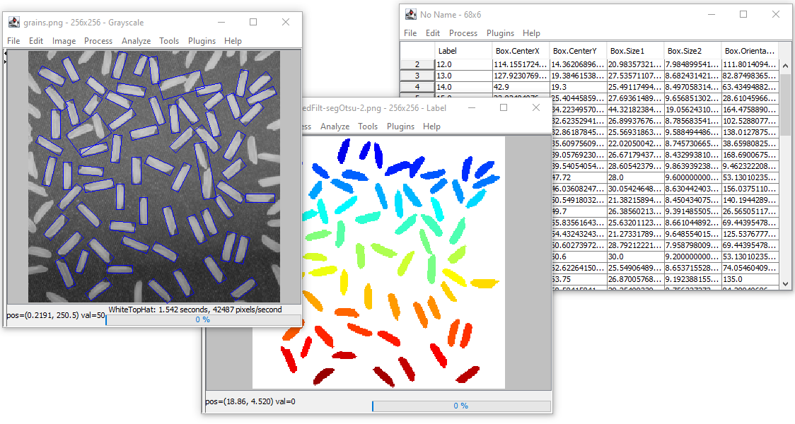

## Imago

Imago is a graphical image processing application written in Java,
with a specific target to the processing and analysis of scientific images. 
The graphical user interface is similar to that of the popular ImageJ software.
The aim is to be able to manage in a user-friendly way images of any dimensionality 
(2D, 3D, timelapse...) and of a large variety of data type (grayscale, floating-points, 
multi-channels, spectra, label maps...).

Among the features:

* import image files in common formats, management of ImageJ TIFF files
* visualisation of 2D/3D grayscale, color or vector images, patial support of multi-channel images
* interactive exploration of images (line profile, histogram...)
* basic editing of images (crop, type conversion, enhance contrast...)
* growing collection of image processing operators (linear or morphological filtering, segmentation, morphological reconstruction...)
* computation of region features from segmented images (area, perimeter, equivalent ellipse...)
* native support of data tables (import, export)
* more to come...

The Imago application is mostly based on the [CS4J library](https://github.com/SciCompJ/cs4j).

## Installation

The simplest way to install is to download a zip version (i.e. a "Imago-x.y.z.zip" file) 
from [one of the latest releases](https://github.com/SciCompJ/Imago/releases).

Unzip the archive, make sure a recent version (21+ required) of java is installed,
open a terminal, and either 1) run the imago.bat script (Windows user) or run the following command:

    java -Xmx4g -Xms4g -cp Imago-0.3.0.jar;lib/cs4j-0.4.2.jar;lib/jcommon-1.0.17.jar;lib/xchart-3.8.0/xchart-3.8.0.jar;lib/jfreechart-1.0.14.jar;lib/gson-2.8.6.jar;. imago.Imago

(you may jave to adapt memory settings or dependency versions)

## Extensions (Plugins)

Imago can be extended by installing user plugins.
Several plugins are provided within the SciCompJ hub.

* [hierarchical-watershed](https://github.com/SciCompJ/hierarchical-watershed) A plugin for performing hierarchical watershed segmentation (the result is a valuation of the watershed boundaries)
* [homogenize-background](https://github.com/SciCompJ/homogenize-background) Make value of background more uniform by removing large-scale trends
* [region-features](https://github.com/SciCompJ/region-features) Adaptation of the RegionFeatures ImageJ plugin for the Imago software
